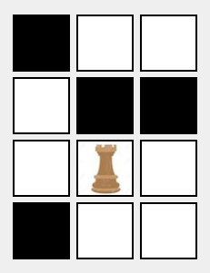
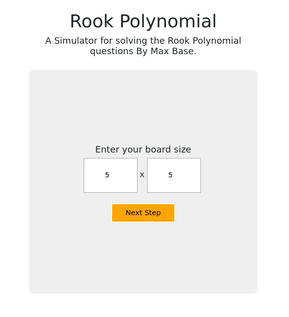
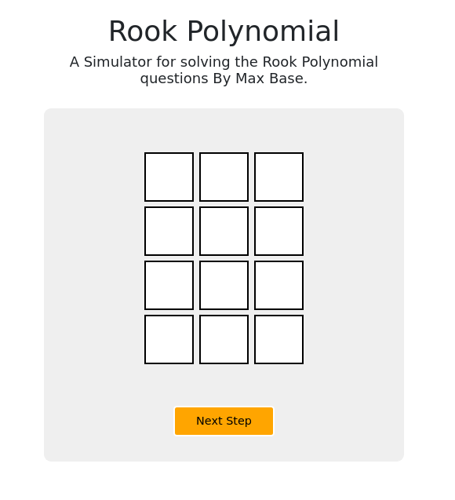
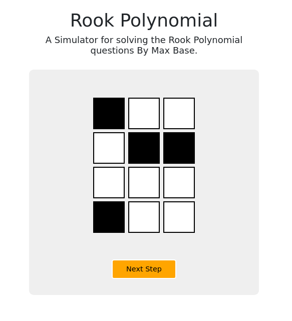

# Rook Polynomial

Algorithm to solving the rook polynomial questions.

# Demo

# Step 1

# Step 2

## What is Rook Polynomial?

In combinatorial mathematics, a rook polynomial is a generating polynomial of the number of ways to place non-attacking rooks on a board that looks like a checkerboard; that is, no two rooks may be in the same row or column.

The board is any subset of the squares of a rectangular board with m rows and n columns; we think of it as the squares in which one is allowed to put a rook.

The board is the ordinary chessboard if all squares are allowed and m = n = 8 and a chessboard of any size if all squares are allowed and m = n. The coefficient of x k in the rook polynomial RB(x) is the number of ways k rooks, none of which attacks another, can be arranged in the squares of B.

The rooks are arranged in such a way that there is no pair of rooks in the same row or column. In this sense, an arrangement is the positioning of rooks on a static, immovable board; the arrangement will not be different if the board is rotated or reflected while keeping the squares stationary.

The polynomial also remains the same if rows are interchanged or columns are interchanged.
